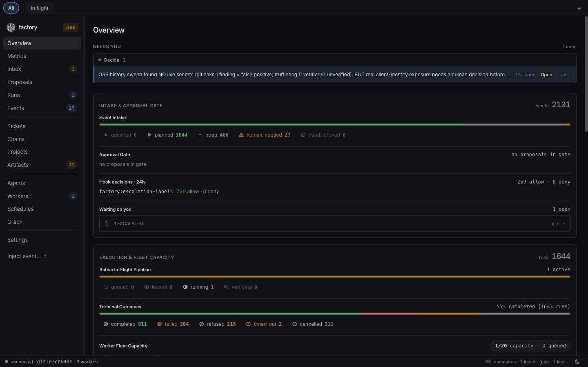
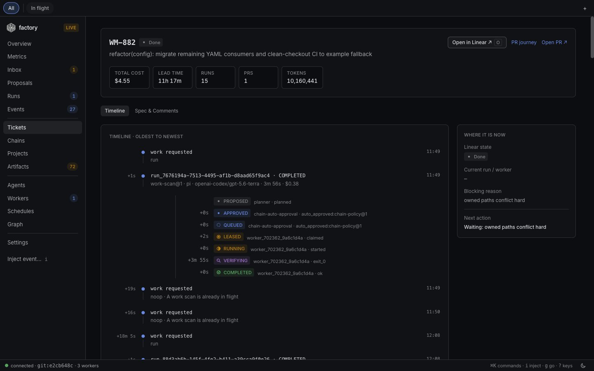

# factory

[](https://github.com/watt-mind/factory/actions/workflows/ci.yml)
[](LICENSE)

<!-- factory-dogfood-badge -->

[](https://github.com/watt-mind/factory/pulls?q=is%3Apr+is%3Amerged)

<!-- /factory-dogfood-badge -->

**The factory that builds software — and itself.**

A runtime for self-improving agentic loops. Code is the first product line.

You already have a coding agent that can write a patch. What you probably do
not have is the process around it: something that decides which work is ready,
hands one agent one ticket in one worktree, re-runs the verification command
itself, and holds the merge until CI and a reviewer agree. That is this.

factory drives the coding agents you already use — Claude Code, Codex, Gemini
/ Antigravity, Cursor, Pi. The tracker is the control plane, GitHub is the
source of truth, and CI is the reward signal. Nothing merges because an agent
said it was done; it merges because the tests passed and a reviewer (agent or
human) approved.


**Status:** the first commit landed on 2026-08-03. The badge above counts the
pull requests the factory has since merged through its own loop. Young
software, used in earnest every day — expect sharp edges, and please
[file them](https://github.com/watt-mind/factory/issues).

## Try it

Bun 1.3+ and Git 2.40+, on macOS 13+ or Linux (x64 / arm64).

```bash
git clone https://github.com/watt-mind/factory.git
cd factory
bun install
bin/factory demo --dry   # print the plan — offline, and what CI runs
bin/factory demo         # claim → implement → verify → PR → merge
```

The demo needs no accounts: no tracker token, no GitHub token, no model API
key. It copies a bundled repository into a temporary checkout, implements the
starter ticket, runs that repository's own tests, opens and merges a pull
request on an in-memory forge, and leaves your clone untouched.

To point the factory at a real repository,
[docs/quickstart.md](docs/quickstart.md) has the path that needs only
`gh auth login` and one coding-agent harness. [SETUP.md](SETUP.md) covers
operator installation, harness links, and the event-runtime daemon.

## Why

Coding agents are good at producing a diff and weak at everything around it:
knowing which ticket is actually ready, staying out of the files another agent
is editing, telling "the tests pass" apart from "I said the tests pass", and
stopping to ask instead of guessing. Those are process problems, so the
factory answers them with process.

- **One ticket, one worktree, one agent process.** Two tickets run at the same
  time only when their `Owned Paths` globs are disjoint.
- **Every ticket carries a verification command**, re-run by the factory after
  the agent reports done. An agent's own report is evidence, never the
  decision.
- **The gate is CI plus a review**, by an agent or a human, on a real pull
  request.
- **The factory holds no product state.** Tickets live in the tracker, truth
  lives in git, and a restart loses nothing. Agents are ephemeral workers; the
  loop is the standing process.

The same runtime already hosts loops that have nothing to do with code (infra
ops, editorial). Software came first because the verification story is
strongest there: tests, types, CI, a diff, a pull request.

For the longer argument, read [docs/thesis.md](docs/thesis.md) on positioning,
[docs/model.md](docs/model.md) on the primitives, and
[docs/architecture.md](docs/architecture.md) on why it is shaped this way,
including the choices that were wrong first.

## The loop

```
Triage ──①triage──▶ ai:agent-ready ──②dispatch──▶ PR ──③merge──▶ Done
                                                             │
                             reaper ◀── crashed claims ◀──────┘
```

Dispatch is rolling: the moment a ticket finishes, its slot refills. Commands
are repo-agnostic verbs and `--repo` supplies the targets, so adding a
repository is configuration rather than a second copy of every job. A
repository without worktree scripts (`bin/worktree-up.sh` /
`worktree-down.sh`) gets a safe concurrency of one; the dispatcher refuses it
rather than inventing ports for tooling that does not exist.

## Control plane

Where work is admitted, claimed, and reviewed. It sits behind a `ControlPlane`
adapter, so the loops never hard-wire one tracker.

| Adapter       | Status       | Notes                                                                                                                                                                              |
| :------------ | :----------- | :--------------------------------------------------------------------------------------------------------------------------------------------------------------------------------- |
| Linear        | v1           | Claim, labels, states, comments. One authority, so two agents cannot both own a ticket                                                                                             |
| GitHub Issues | shipping     | Issues, labels, and a Projects `Status` field. No third-party account; today you create the Project and the labels by hand, from what `factory init --control-plane github` prints |
| Memory        | demo / tests | In-process, for `factory demo` and offline runs                                                                                                                                    |

GitHub is the forge either way: the pull request is the artifact, the branch
is the work, CI is the gate.

## Commands

Prefixed `factory-` so they are identifiable as ours and never collide with a
repo-local or built-in command of the same name.

| Command             | Does                                                                                           |
| :------------------ | :--------------------------------------------------------------------------------------------- |
| `/factory-work`     | Claims agent-ready tickets, dispatches them rolling, lands the PRs                             |
| `/factory-ticket`   | Implements exactly one already-claimed ticket in the current worktree — what `tick.mjs` spawns |
| `/factory-merge`    | Reviews open PRs, fixes what's mechanical, merges what qualifies                               |
| `/factory-ship`     | Opens the `develop` → deploy-branch PR, waits for CI, merges, verifies the deploy              |
| `/factory-triage`   | Turns `Triage` tickets into `ai:agent-ready` ones                                              |
| `/factory-unblock`  | Re-examines `ai:blocked` holds and releases the ones new evidence resolved                     |
| `/factory-sweep`    | Retires tickets overtaken by events — `Canceled`/`Duplicate` with evidence, never a delete     |
| `/factory-audit`    | Grades a repo against project-conventions `PC-01`..`PC-20`, files the gaps                     |
| `/factory-capture`  | Files an issue from the conversation — capture only, never implement                           |
| `/factory-friction` | Files harness friction seen in an interactive session, where no transcript exists              |
| `/factory-retro`    | Turns measured friction into harness changes                                                   |
| `/factory-report`   | Read-only pipeline snapshot across the configured repos                                        |
| `/factory-next`     | Picks the one next stage for this repo, and runs it only when asked                            |

### `factory status` — the everyday hub

```bash
factory status
factory status --repo <name>
factory status --json
```

Read-only: which repository and branch you are in, whether the checkout is
clean, fetched remote refs, deployment freshness, live tracker counts, and the
single recommended next action.

## Agents

Isolated specialist contexts, so a large body of evidence can be examined
without it landing in the calling session's context.

| Agent                    | Does                                                                                                               |
| :----------------------- | :----------------------------------------------------------------------------------------------------------------- |
| `factory-ux-critic`      | Exercises a materially changed user journey and returns a read-only `SHIP` / `FIX-FIRST` critique                  |
| `factory-merge-reviewer` | Reviews one PR cold and returns `MERGE` / `FIX` / `ESCALATE`, so the diff never enters the merge session's context |
| `factory-ci-doctor`      | Diagnoses one red Actions run and classifies it `TICKET` / `ENV` / `FLAKE`, keeping the job logs out of the caller |
| `factory-infra-scout`    | Answers questions that need SSH or container output, returning a verdict rather than the dumps                     |

## Harnesses

The **content** is portable; only the **packaging** is not. `SKILL.md` is a
shared workflow format, command bodies are Markdown, and each harness gets its
native agent manifest.

| Harness     | Context                   | Skills              | Commands                    | Agents                |
| :---------- | :------------------------ | :------------------ | :-------------------------- | :-------------------- |
| Claude Code | `CLAUDE.md` → `AGENTS.md` | plugin `skills/`    | plugin `commands/`          | plugin `agents/`      |
| Codex       | `AGENTS.md` (native)      | `~/.agents/skills/` | — (use `@factory-*` skills) | `~/.codex/agents/`    |
| Gemini CLI  | `GEMINI.md` → `AGENTS.md` | `~/.gemini/skills/` | —                           | `~/.gemini/agents/`   |
| Antigravity | shares `~/.gemini/`       | via Gemini          | —                           | via Gemini            |
| Cursor      | `.cursor/rules/`          | —                   | `~/.cursor/commands/`       | `~/.cursor/agents/`   |
| Pi          | `AGENTS.md` (native)      | `dist/pi/skills/`   | `dist/pi/prompts/`          | `~/.pi/agent/agents/` |

> [!IMPORTANT]
> **The plugin is a convenience layer, not the safety floor.** It reaches
> Claude Code only. The non-negotiables live in `shared/floor.md` and are
> committed into each repo's **`AGENTS.md`**, which every harness reads and
> which travels with the checkout.

From a repository you want to automate with Claude Code:

```json
// <repo>/.claude/settings.json
{
  "extraKnownMarketplaces": {
    "factory": { "source": { "source": "github", "repo": "watt-mind/factory" } }
  },
  "enabledPlugins": ["core@factory"]
}
```

## Operator UI

The web console an operator watches while loops run: live intake, runs,
events, agents, the runtime graph, and a ticket journey.





Twenty-odd more stills — run detail, proposals, chains, schedules, the command
palette — are in [`docs/screenshots/`](docs/screenshots/).

## Fork your factory

Fork an instance, not the kernel. The
[`factory-starter`](templates/starter/) scaffold keeps your repository
routing, local policy, schedules, and optional packs in a repository that pins
the factory as a dependency, so your organization can improve its own factory
and still track the shared runtime.

[docs/instances.md](docs/instances.md) has the kernel/instance boundary, the
upgrade path, and how to send reusable kernel improvements back upstream.

## Layout

```
shared/                           harness-neutral content, the only place to edit
  floor.md                        the non-negotiables (goes into every AGENTS.md)
  commands/                       the /factory-* commands
  skills/                         ticket-spec (SKILL.md — a format all harnesses share)
  agents/                         factory-{ux-critic,ci-doctor,infra-scout,merge-reviewer}
build/emit.mjs                    shared/ -> per-harness packaging; --check guards drift
plugins/core/                     GENERATED — the Claude Code plugin
dist/{codex,gemini,cursor,pi}/    GENERATED — the other harnesses
orchestrator/                     dispatch logic (owned-paths collision, tick)
event-runtime/                    event-driven sidecar — intake, planner, worker, receipt
runners/run-agent.sh              one harness session against one repo
bin/factory                       the cwd-independent CLI
bin/worktree-{up,down}.sh         this repo's own worktree lifecycle
lib/, tools/                      helpers: transcripts, spend, schedule, trackers
config/repos.yaml                 per-repo routing: team, base, worktree scripts, verify
config/schedule.yaml              cadences
config/policy.yaml                budgets, concurrency, escalation
ee/                               reserved open-core seam (empty of product code)
```

Everything under `plugins/` and `dist/` is generated from `shared/`, and CI
fails if the tree drifts. [CONTRIBUTING.md](CONTRIBUTING.md) has the rules for
changing it.

## Open-core boundary

The orchestration, event runtime, shared agent workflows, harness packaging,
and public extension contracts form the open core. This repository is licensed
under Apache License 2.0 and is meant to stay useful, buildable, and testable
without private services or unpublished code.

[`ee/`](ee/README.md) reserves an explicit seam for possible enterprise-only
extensions. Core code may expose generic contracts that enterprise extensions
implement, but it must not import or depend on enterprise implementations. The
directory currently contains documentation only. If separately licensed code
is added there in the future, it must carry explicit terms; placement under
`ee/` alone does not override the repository license.

## Docs

| Doc                                                | What it is                                                     |
| :------------------------------------------------- | :------------------------------------------------------------- |
| [docs/quickstart.md](docs/quickstart.md)           | The offline demo, then the first real pull request             |
| [docs/thesis.md](docs/thesis.md)                   | Positioning: an unattended software factory first              |
| [docs/model.md](docs/model.md)                     | Public primitives in this repository's vocabulary              |
| [docs/architecture.md](docs/architecture.md)       | Why the factory is shaped this way                             |
| [docs/orchestrator.md](docs/orchestrator.md)       | Master orchestrator guide and operating loops                  |
| [SETUP.md](SETUP.md)                               | First-time setup, harness links, event-runtime daemon          |
| [ROADMAP.md](ROADMAP.md)                           | Now / Next / Later across harnesses, packs, and control planes |
| [PACKS.md](PACKS.md)                               | Directory of reusable factory packs                            |
| [ADOPTERS.md](ADOPTERS.md)                         | Organizations and teams using the factory                      |
| [SECURITY.md](SECURITY.md)                         | Vulnerability reporting and the autonomous-agent threat model  |
| [ee/README.md](ee/README.md)                       | Open-core / enterprise seam                                    |
| [event-runtime/README.md](event-runtime/README.md) | How to run the event-runtime sidecar                           |

## Contributing

Bug reports, packs, harness support, and control-plane adapters are all
welcome. [CONTRIBUTING.md](CONTRIBUTING.md) covers setup, tests, and commit
conventions; contributions are accepted under the [CLA](CLA.md), and everyone
is held to the [Code of Conduct](CODE_OF_CONDUCT.md).

Questions and show-and-tell belong in
[Discussions](https://github.com/watt-mind/factory/discussions). Security
issues go through [SECURITY.md](SECURITY.md) rather than a public issue.

## License

Licensed under the [Apache License 2.0](LICENSE). See [NOTICE](NOTICE) for
attribution information.
